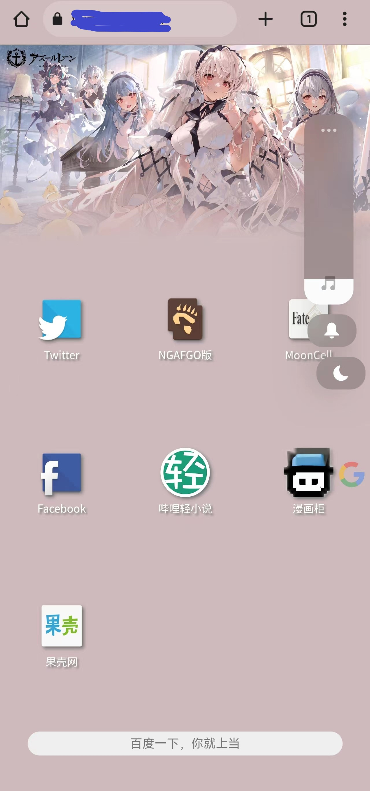

# 自用手机版浏览器主页
## 预览

## 说明
* 本项目为自用，仅在chrome手机版上测试成功，拥有数不清的兼容性问题。
* 横屏可用，但推荐在竖屏下使用。
* 顶图随机变化，放置在background文件夹，推荐使用webp图片以加快加载速度。
  * 长按顶图可重置书签状态。
* 图标可无限量添加，放置在img文件夹，并可通过滚动查看。

## 鸣谢
Color Thief、张鑫旭、SUSU CSS及其他不知名的教程作者。